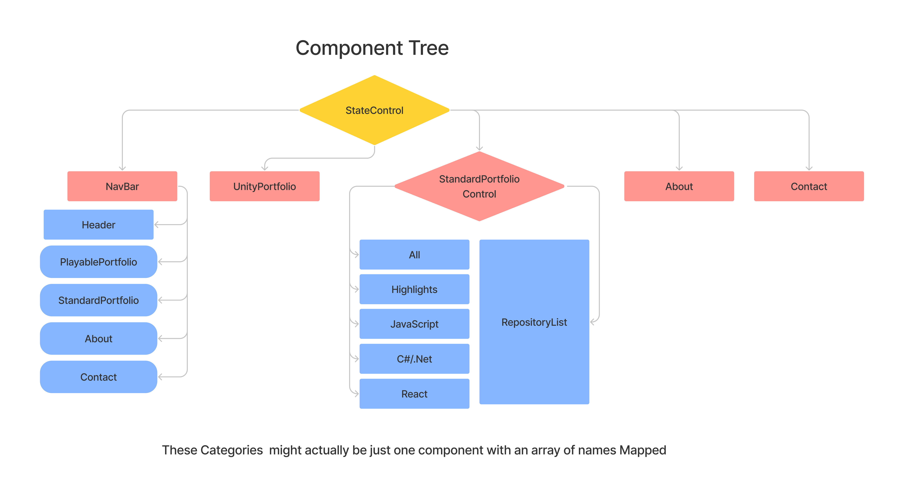

## Diagrams

### Planning log
* Note: This is in Alaska time 
2/18 
* 10:45 Start Figma
* 11:10 - 12 research Rest Api for github
* 12 12:20 researching Iframes
* 12:30 sleep (flights to wedding from 12 am to 10 am, so tired)
* 2:30 - 2:45 more research into Rest api https://api.github.com/users/jlewilson/repos?per_page=1
* 2:45 - 3 re-familiarizing myself with promises and api calls
* 3 - 3:45 Looking over unity documentation and previous works for component information
* 3:45 Done for day 1, off to wedding

2/19
* 7-8:30am Read unity documentation while waiting for wedding to begin/guests to show up, Rigidbody2d, Collider2d, Monobehaviour vs Scriptable Objects, TileMap, 

2/20
* 12-1:15 Build project bones
* 5:30 - 6:10 Add component tree to figma
* 6:10 - 6:45  Research unity Scriptable Objects 
* 6:45 - 7:10 Adjust project bones
* 7:10 - 7:30 set up Unity project bones
* 7:30 8:30- Read Unity WebGl Docs, researching browser control within unity/ trouble shoot unity/vscode intellisense  issues

02/21
* 4 - 5 Research react-unity-webgl package
6:30 -7:20 Debug unity object not showing in react, Finally fixed!!!!! Now I just need to resize the unity components, Also my javascript works within unity! I can open a new tab perfectly

02/25
* 8:15 - 9 Setting up routs, was unable to get working
* 9 Rereading routs in learn to program
9:20 Got routs to work, needed "exact" keyword on home route, going to add changes and commit now that it works

1:30-: 3:45 researching concat, and promise chaining

03/02

6:00-8:00 Drawing test art assets

03/04

12-3 Adding topics to all github projects to be displayed on portfolio, adding readmes to old projects I want to display